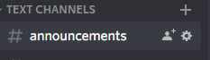
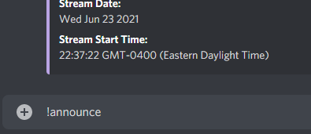
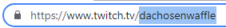
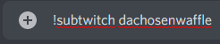
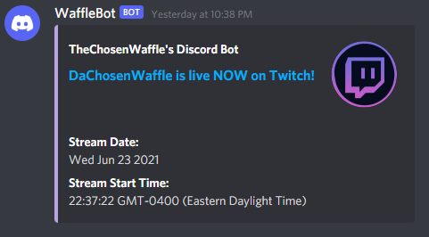

# WaffleBot Discord Bot

## Contents

- [Overview/About](#overview)
- [General Usage, Functionality, and Technologies](#general-usage)
- [Twitch Notification Usage](#twitch-notification-subscription-usage)
- [File Structure](#file-structure)
- [Backend Structure](#backend-structure)
- [API Structure](#api-structure)
- [Links, Support, and Dependencies](#links)

## Overview

**WARNING: POSSIBLE COMMAND CONFLICTS WITH OTHER BOTS USING THE '!' COMMAND PREFIX**

Lightweight discord bot with moderation capability and more. Subscribes to [Twitch's EventSub](https://dev.twitch.tv/docs/eventsub) services to alert a Discord server when a subscription notification is received.

Invite the bot to your server [here](https://discord.com/api/oauth2/authorize?client_id=824004407154835496&permissions=0&scope=bot)

## General Usage

- For a list of commands within Discord, just type "!help" in any channel where the bot can see messages.
- If you want more specific information on a single command, type "!help" followed by the command you'd like more information on. (EX: "!help help")
- Scroll down further for a quick setup guide for making use of the Twitch subscription service!

## Functionality

- User Moderation within a Discord server/guild
- Creating or removing a subscription to a specified Twitch broadcaster's `stream.online` notification
- Listing all active Twitch notification subscriptions
- Advanced console logging, published as an independent package on [npm](https://www.npmjs.com/package/honath-simple-logger)

## Technologies
- Discord.js, Node.js, Express.js, Axios, Knex.js, PostgreSQL, RESTful API Endpoints
- External API: [Twitch](https://dev.twitch.tv/docs/api/reference)
- Development Environment: DBeaver, Postman
- Other Tools: Adobe Photoshop, Discord Desktop Application

## Twitch Notification Subscription Usage

### ✔️ Setting up a new subscription

#### 1. Set the discord channel where you would like the announcements to go, and type !announce (requires Admin privileges)

| Find the Channel                                            | Type "!announce"                                         |
| ----------------------------------------------------------- | -------------------------------------------------------- |
|  |  |

#### 2. Find the Twitch "login" username of the streamer you wish to subscribe to



###### (This will be in the URL on Twitch)

#### 3. In any channel where the bot can see messages, type this command followed by the username found in Step 2: "!subtwitch"



#### 4. That's it! When that streamer goes live, the bot will receive a notification, and send a message to your preset announcements channel!



### ❌ Removing a subscription

Find the login name of the broadcaster/streamer (as shown above) that you would like to unsubscribe from, and type `!unsubtwitch <username>`

### 📜 Listing active subscriptions

All you need to do is type `!listtwitch`. It's that easy!

## File Structure

- `./`
  - **bot.js** (main file - also contains base API/server functions)
  - **.env** (tokens, keys, URLs, etc. Git Ignored)
  - **knexfile.js** (knex configuration file for database connections)
  - `./commands`
    - `./commands/moderation`
      - **kick.js** (kick a user via command. Moderator+ only.)
      - **ban.js** (ban a user via command. Moderator+ only.)
      - **timeout.js** (remove a user's ability to chat for 10 min via command. Moderator+ only.)
    - `./commands/subscriptions`
      - **listTwitchSubs.js** (lists all active notification subscriptions. Admin only.)
      - **subscribeTwitch.js** (subscribes to a Twitch channel for stream notifications. Admin only.)
      - **unsubscribeTwitch** (unsubscribes from a Twitch channel for stream notifications. Admin only.)
    - `./commands/utility`
      - **help.js** (help command, lists all commands in bot-**commands.json** intelligently)
      - **setAnnounceChannel.js** (sets current channel where message is sent as the default "announcements" channel.)
    - `./commands/testing` (testing/developer commands. Git ignored)
  - `./resources`
    - **config.json** (Stores bot prefix + some possibly deprecated URIs)
    - `./resources/images`
      - **general images for use in README**
  - `./api`
    - **subscriptionRouter.js** (verbose, scalable router for subscribing to external services)
    - `./api/twitch`
      - **twitch.router.js** (handles Twitch API routes)
      - **twitch.controller.js** (API endpoints for Twitch HTTP requests)
      - **twitch.service.js** (creates and sends queries to the DB)
      - **twitchAPI.js** (handles outgoing requests made to Twitch API for accessing and retrieving data and EventSub subscriptions)
    - `./api/errors`
      - **notFound.js** (sends custom 404 not found to error handler)
      - **methodNotAllowed.js** (sends custom 405 not allowed to error handler)
      - **errorHandler.js** (all purpose error handler/wrapper. Takes in status code and message)
      - **asyncErrorBoundary.js** (async function wrapper to handling possible errors)
    - `./api/common`
      - **verifyAuthToken.js** (validates and verifies the token/passcode for interacting with API)
      - **announcementExists.js** (queries DB to check if an announcement channel is set for a discord guild/server)
      - **verifyAnnouncementResults.js** (simple middleware to throw an error if announcement entry not found in DB)
  - `./lib`
    - **logger.js** (logging/debugging class for use in console messages)
    - **notifyDiscord.js** (notification class for sending Discord notifications, methods for notification origin)
  - `./db`
    - **connection.js** (establishes knex connection to database depending on dev or production environment)
    - `./db/migrations`
      - **migration files** (handles table creations and other types of database migrations)
    - `./db/seeds`
      - **seed files** (information to be stored in the database, mainly for testing)

## Backend Structure

- Announcements (database table)

  - guild_id
  - channel_id
  - created/updated_at timestamps

- Subscriptions (database table)
  - id (auto-generated incrementing ID)
  - guild_id (foreign key)
  - broadcaster_id
  - created/updated_at timestamps

## API Structure

API Overview

```
  /
  .
  └── /twitch
      ├── /callback
      |   └── POST
      |
      ├── /subscriptions/:guild_id
      |   └── GET
      |       |
      |       POST
      |       |
      |       DELETE
      | 
      ├── /announcements/:guild_id
      |   └── GET
      |       |
      |       PUT
      |
      ├── /announcements
      |   └── GET
```

## Links

✅ I'd really appreciate it if you checked me out on [Twitch](https://www.twitch.tv/dachosenwaffle), [Twitter](https://twitter.com/thechosenwaffle), or [YouTube](https://www.youtube.com/c/ChosenWaffle1)!  
🧡 If you'd like to support the development of this and other projects, please feel free to support me on [Patreon!](https://www.patreon.com/thechosenwaffle)  
🏴 [Live Changelog](https://github.com/honath/waffle-bot/blob/master/changelog.md)

## Support and Bugs

- If you'd like to contact me regarding any issues with this bot, or just have a suggestion, please open it as an issue on the GitHub repository [here.](https://github.com/honath/waffle-bot/issues/new)

## Dependencies

- [discord.js](https://discord.js.org/#/)
- [dotenv](https://www.npmjs.com/package/dotenv)
- [node](https://nodejs.org/en/)
- [express](https://expressjs.com/)
- [axios](https://github.com/axios/axios)
- [knex](https://knexjs.org/)
- [pg](https://www.npmjs.com/package/pg)

## DevDependencies

- [nodemon](https://www.npmjs.com/package/nodemon)

[Back to Top](#wafflebot-discord-bot)
